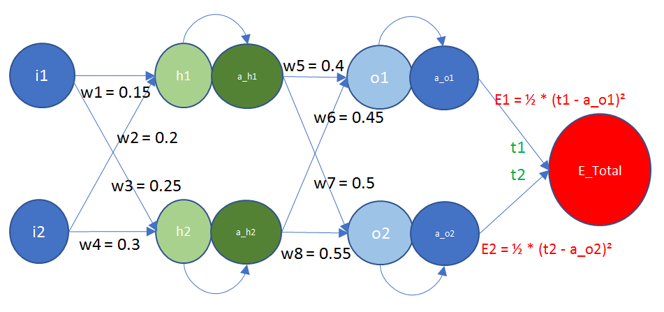
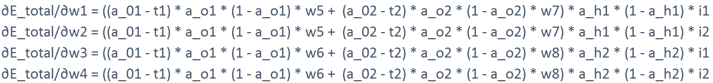
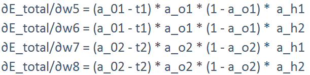

# ERA_S6_Assignment

## Part 1
Backpropagation Calculation for Neural Network. 
This is the network for which we'll be calculating the backpropagation

Based on the error we have gotten (E Total), we will be calculating the partial derivatives of the error with respect to the individual weights, as the weights are the ones that we'll be updating. The activation function in our case will be a sigmoid function. We get the following equations upon derivation.

