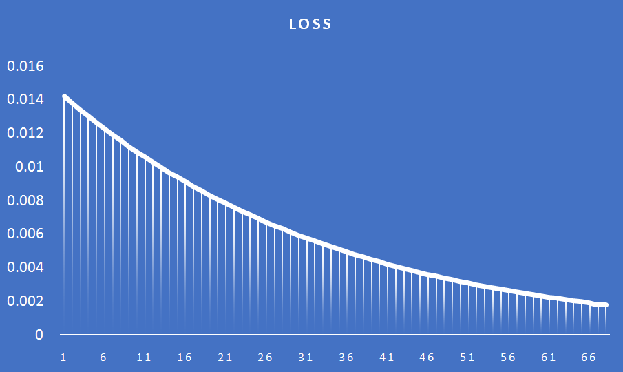

# ERA_S6_Assignment

## Part 1
Backpropagation Calculation for Neural Network. 
This is the network for which we'll be calculating the backpropagation

Based on the error we have gotten (E Total), we will be calculating the partial derivatives of the error with respect to the individual weights, as the weights are the ones that we'll be updating. The activation function in our case will be a sigmoid function. We get the following equations upon derivation.

Using the above equations, we will be getting the gradients for each of the weights of the network.
Next, we'll be updating our weights by using the equation -> New weight W1 = Old weight W0 - Learning Rate * Weight Gradient (derivative) to reduce the overall error (loss) of the network. This step will be repeated until the loss tends to 0. We will be experimenting with various learning rates to observe the different loss graphs.

### Learning Rate = 0.1

### Learning Rate = 0.2

### Learning Rate = 0.5

### Learning Rate = 0.8

### Learning Rate = 1

### Learning Rate = 2

